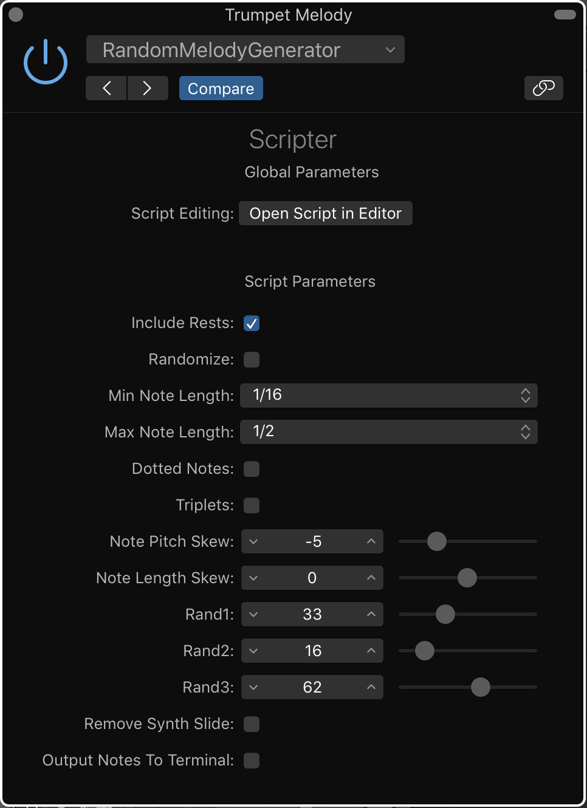
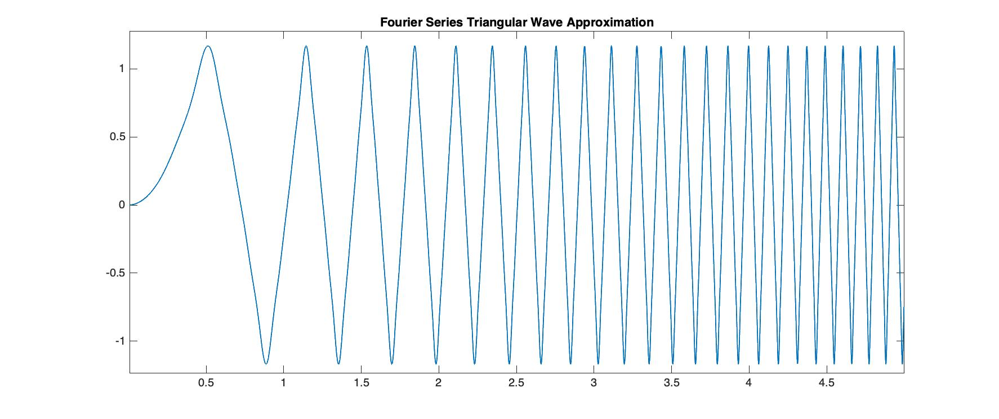

# Logic Scripter - Random Melody Generator
> This is a program built using the Logic X Midi Fx Scripter Plugin. It generates a random melody based on the notes you enter in and settings you set for the melody. 

[![Build Status][travis-image]][travis-url]
[![Downloads Stats][npm-downloads]][npm-url]

This program It provides more customisability than the standard logic arpeggiator, in that it allows changing and specifying note lengths used, adding triplets, adding dotted notes, adding rests and skewing of melodies to fit your requirements. 

This culminates in a tool that can be used to gain some inspiration to make a new song or get out of a rut with a song you have been working on for a while. 

## Installation

- Download the code from git
- Open the .js file in /src using text edit

In Logic Pro X:
- Create a new software instrument/use a current software instrument
- Add the 'Scripter' Midi Fx
- Copy the .js code from your text edit into the Scripter editor
- Click 'Run Script' at the top right of the editor
- You are now using the Random Melody Generator (save it as a preset to use it quickly in future)

## How to use it

### Generate a Melody
1. Enter the notes you want to use in your melody
    - This could be a scale or enter chords if you want some arpeggios

2. Click the Randomize button to generate a random melody (continue clicking if you don't like the melody generated)
    - You may need to click play on the project once for the Randomize button to work correctly

### Customise the melody to fit your needs
* Choosing note lengths:
- Choose the maximum and minimum note lengths you want to use from the drop down menus
- ensure maxumum > minimum otherwise the melody will only use quater notes by default

* Adding triplets, dotted notes or rests:
- Just click on the respective checkboxes for these to include them
- these notes will be in the range, that has been set with the maximum and minimum note length menus

* Skewing the randomised melody pitch and used note lengths
This feature allows you to change the probability of what note pitches are played in the melody and what note lengths are used

Pitch Skew
- Skewing to the left increases the probability of notes on the lower end of the notes you've entered occuring in the melody, so creating a melody that is based more around the lower end of the scale you entered.
- Skewing to the right increases the probability of notes on the higher end of the notes you;ve entered occuring in the melody, so creating a melody that is based more around the higher end of the scale you entered.

Note Length Skew
- Skewing to the left increases the probability of the shortest note lengths specified occuring in the melody, so creating a melody that uses shorter rhythms more often.
- Skewing to the right increases the probability of the longer note lengths specified occuring in the melody, so creating a melody that uses longer rhythms more often.

### Removing Synth glide from the melody
- Check the Remove Synth Slide checkbox

### Use the generated melody across the project (outputting generated melody to another track)
Unfortunatly Logic dosen't provide a way to (or I have not yet found out how to) output a software instrument track from the generated melody of the melody generator so the best I could do was, to output the information of what happens in the melody to the terminal which can be traced to another software instrument track, if you want to use that melody at different points in the track (since it changes based on the current beat).
To do this:
- Select the 'Output Notes To Terminal' button
- Then open the script editor using the 'Open Script in Editor' button
- Then play the section that you want to know what the melody generated was
- This will be outputted in the terminal (bottom section of the editor) with the note information and lengths
- Open a new software instrument track and copy the notes ouputted to the terminal (it's monophonic so one note at a time)

## Usage example

-Input a scale that fits some chords you have already input and generate a melody to give you some inspiration for a new song.

-Enter in the chords you're using again, and get some new arpeggios.

## How it works

The pitch is chosen by the melody generator is chosen using 2 factors, the generated random numbers and the current beat number. These 2 pieces of information are used in a equation to sample randomly from fourier series approximation a trianglar wave with increasing frequency (Figure 1). The triangular wave has a a minimum of 0 and maximum of the number of notes input, the sampled value is rounded to a whole number and this is used as the reference for the note pitch to use out of the notes input. The note length is selected similarly using the triangular wave but instead it is the amount of possible note lengths that are selected from. Changing the random seed means different points of the triangular wave are sampled so gving a different melody.

Figure 1 - Triangular Wave used for random melody generating

The skew feature works using a cosine wave with amplitude and position being dependant on the amount of skew set. The cosine wave dictates how many times each note is included in the random note generator, in that those toward the side that it is skewed, will appear multiple times in the possible notes array and so will be more likely to be selected in the generated melody. All notes have a base of occuring once in the note array as to ensure they can be included even if it is not as probable.

Any other feature explanations are included in the comments in the code sufficently.

## Development setup

To develop just edit the javascript code using the 'Open Script In Editor' button at the top of the plugin.

The Logic scripter is not very well documented, to develop it is recommended you look up the 'Simple Arpeggiator' or 'Sequencer' examples and the 'Tutorial Scripts' that are given in Logic. If you are unsure on anything send me an email (given below).

## Release History

* 1.0.0
    * The first version of the software

## Meta

Your Name – [@JoeRobotMusic](https://twitter.com/JoeRobotMusic) – joeyrc@hotmail.co.uk

Distributed under version 2.0 of the Apache License. See ``LICENSE`` for more information.

An overview of the project has been provided on my YouTube channel: Coming Soon!

[https://github.com/joe-robot/Logic-Scripter---Random-Melody-Generator](https://github.com/joe-robot/Logic-Scripter---Random-Melody-Generator)

## Contributing

1. Fork it (<https://github.com/joe-robot/Logic-Scripter---Random-Melody-Generator/fork>)
2. Create your feature branch (`git checkout -b feature/fooBar`)
3. Commit your changes (`git commit -am 'Add some fooBar'`)
4. Push to the branch (`git push origin feature/fooBar`)
5. Create a new Pull Request

<!-- Markdown link & img dfn's -->
[npm-image]: https://img.shields.io/npm/v/datadog-metrics.svg?style=flat-square
[npm-url]: https://npmjs.org/package/datadog-metrics
[npm-downloads]: https://img.shields.io/npm/dm/datadog-metrics.svg?style=flat-square
[travis-image]: https://img.shields.io/joe-robot/Logic-Scripter---Random-Melody-Generator/node-datadog-metrics/master.svg?style=flat-square
[travis-url]: https://joe-robot-ci.org/Logic-Scripter---Random-Melody-Generator/node-datadog-metrics
